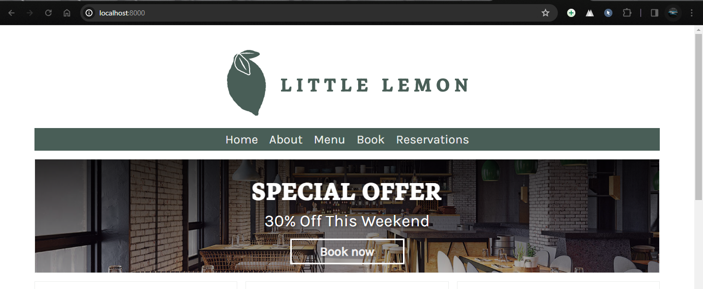
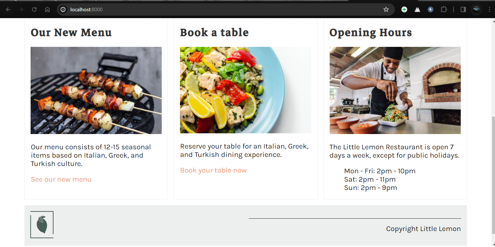
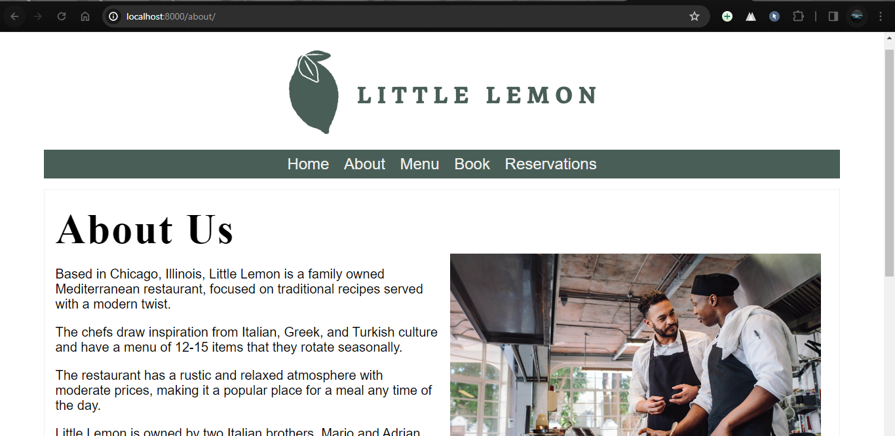
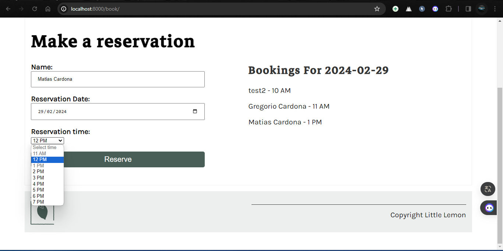
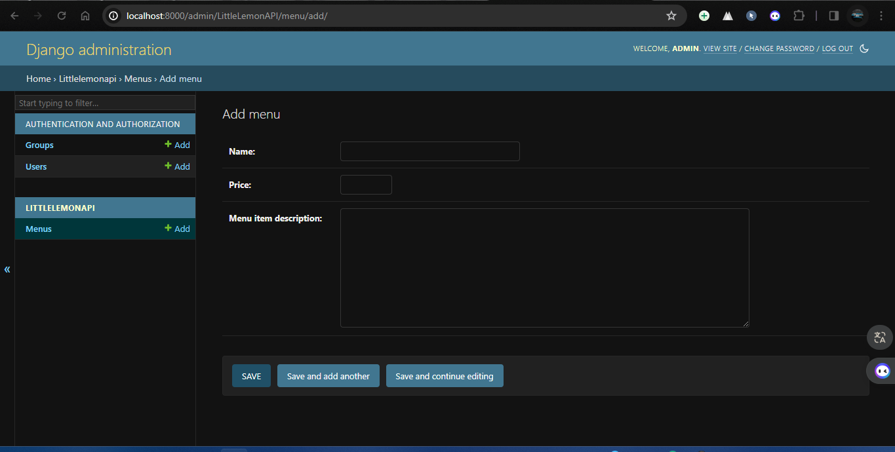
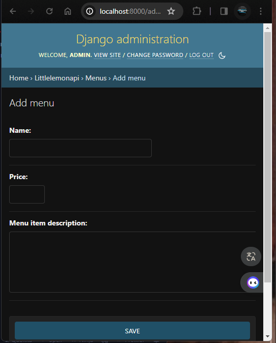

# Final Project - Little Lemon Restaurant Backend Integration and API Setup

## Overview
This project serves as the final assessment for the course Back-End Developer Capstone which is the final course of the Meta backend professional certificate. The assessment consists of three exercises and one final graded quiz. The primary purpose of these assessments is to evaluate your knowledge and understanding of the key learning objectives covered in the course. By completing these assessments, you can identify mastered topics and areas that require further focus before completing the course.

## Purpose
The main goal of this final project is to apply the skills and knowledge acquired throughout the course. Specifically, the project tasks include:
- Connecting the Little Lemon restaurant back-end to MySQL.
- Setting up a Little Lemon restaurant booking API.
- Inserting booking data into the database via the booking API.

## Tools and Technologies
To complete this project, the following tools and technologies will be utilized:
- Django Framework: For backend development and API creation.
- MySQL Database: For storing restaurant booking data.
- RESTful API Principles: To design and implement the booking API.
- Git Version Control: For managing project versions and collaboration.
- Markdown: For documentation and README file formatting.

## Project Structure
The project will consist of the following components:
1. **Backend Integration**: Setting up Django to connect with MySQL database, ensuring seamless integration between the backend application and the database.
2. **API Development**: Designing and implementing a RESTful API for Little Lemon restaurant bookings. This API will handle requests to create and retrieve booking data.
3. **Database Management**: Managing database schema, migrations, and ensuring data integrity.
4. **Testing and Peer Review**: Assessing the functionality of the implemented API through testing and peer review submissions.

## Assessment Process
### Exercises and Peer Review
- **Tasks**: The exercises will involve tasks related to connecting the backend to MySQL, setting up the booking API, and inserting booking data.
- **Scope**: All tasks will be within the scope of the course content.
- **Expectation**: Successful completion of the exercises requires applying skills and knowledge learned throughout the course.
- **Assessment**: Peer review submission will assess the completeness and correctness of the implemented tasks.

### Graded Quiz
- **Coverage**: The quiz will cover topics discussed throughout the course.

- **Assessment**: The quiz aims to evaluate understanding and retention of course concepts.

## Conclusion
By completing this final project, you will demonstrate proficiency in integrating a backend application with a database, designing and implementing a RESTful API, and managing database operations. This project serves as a culmination of your learning journey in the course, helping you apply theoretical concepts to real-world scenarios.

## HOME

## ABOUT

## BOOK

## ADMIN PANEL

## RESPONSIVE

